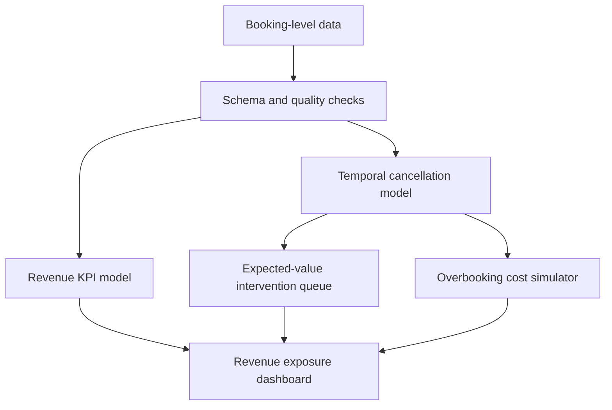

# StaySignal — Hotel Revenue & Cancellation Decision Intelligence

[](https://www.python.org/)
[](tests/test_project.py)
[](data/README.md)

StaySignal is an end-to-end hotel revenue intelligence project that answers a more useful question than “Will this booking cancel?”:

> **Which future bookings deserve action, what is the expected financial value of that action, and how much inventory risk should the hotel accept?**

The project joins data-quality validation, business KPIs, leakage-aware machine learning, profit-based intervention prioritization and an overbooking cost simulator in one reproducible workflow.

## Why this project is different

Most cancellation projects stop at model accuracy. StaySignal makes the prediction operational:

- reconciles booked revenue into realized revenue and cancellation exposure;
- evaluates a cancellation model on a chronological future holdout;
- ranks bookings using expected net value rather than risk probability alone;
- separates priority outreach, automated reminders and no-action decisions;
- compares empty-room cost with guest-walk cost across overbooking buffers;
- exposes limitations and synthetic-data provenance instead of presenting demo metrics as real hotel results.

## Live dashboard

Open the GitHub Pages dashboard at:

**https://shrutivan17.github.io/portfolio/staysignal/**

The dashboard is static and recruiter-friendly; its numbers are generated by the Python analysis pipeline from the documented demo dataset.

## System architecture



## Decision model

The intervention policy uses booking economics:

```text
expected revenue saved = cancellation probability × booking value × recovery rate
expected net value      = expected revenue saved − intervention cost
```

High-risk bookings are not automatically contacted. A low-value stay can be risky but uneconomic to pursue; a higher-value stay with moderate risk may deserve attention.

## KPI definitions

| KPI | Definition | Decision supported |
|---|---|---|
| Cancellation rate | canceled bookings / all bookings | Monitor demand reliability |
| Booked revenue | ADR × nights for all bookings | Measure gross pipeline value |
| Realized revenue | booked revenue from non-canceled stays | Track retained booking value |
| Revenue at risk | booked revenue from canceled stays | Size preventable exposure |
| Expected net value | predicted recovery value − action cost | Prioritize interventions |
| Overbooking cost | empty-room cost + guest-walk cost | Choose an inventory buffer |

## Model validation

- **Split:** first 80% of arrivals for training; most recent 20% for holdout.
- **Target:** `is_canceled`.
- **Leakage control:** no reservation-status or post-outcome fields are included.
- **Metrics:** ROC-AUC for ranking, average precision for imbalance and Brier score for probability quality.
- **Model:** balanced random forest with mixed numeric and categorical preprocessing.
- **Interpretability:** holdout permutation importance.

The committed dashboard reports the executed demo results. Because the data is synthetic, these results demonstrate pipeline behavior—not production performance or a causal estimate of intervention impact.

## Repository structure

```text
staysignal/
├── index.html                 recruiter-facing dashboard
├── app.js                     dependency-free dashboard charts
├── styles.css                 responsive visual system
├── data/
│   ├── README.md              provenance and schema notes
│   └── summary.json           aggregated synthetic demo output
├── scripts/
│   ├── generate_demo_data.py  deterministic data generator
│   └── run_analysis.py        end-to-end analytical build
├── src/staysignal/
│   ├── data.py                schema validation
│   ├── metrics.py             KPI calculations
│   ├── model.py               temporal model evaluation
│   └── decisions.py           interventions and overbooking
├── sql/
│   ├── data_quality_checks.sql
│   └── revenue_kpis.sql
├── tests/test_project.py      reconciliation and behavior tests
└── ../.github/workflows/staysignal-ci.yml  automated validation
```

## Run locally

```bash
python -m venv .venv
source .venv/bin/activate       # Windows: .venv\Scripts\activate
pip install -r requirements.txt

python scripts/generate_demo_data.py --rows 6000
PYTHONPATH=src python scripts/run_analysis.py
python -m unittest discover -s tests -v

python -m http.server 8000
```

Open `http://localhost:8000`.

## Replace the demo data

Provide a booking-grain CSV and run:

```bash
PYTHONPATH=src python scripts/run_analysis.py \
  --input data/your_hotel_bookings.csv \
  --output data/summary.json
```

Required columns and validation rules live in [`src/staysignal/data.py`](src/staysignal/data.py). Adjust the inventory and cost assumptions in `simulate_overbooking` before treating its output as an operating recommendation.

## Responsible-use notes

- This is decision support, not an automated guest-treatment system.
- Do not use protected characteristics for intervention eligibility.
- Validate probability calibration, local inventory and recovery assumptions before deployment.
- A randomized pilot is required to estimate the true causal recovery rate from outreach.
- Production monitoring should cover model drift, channel mix, realized uplift and guest complaints.

## Business recommendations demonstrated

1. Prioritize positive-value bookings instead of contacting every high-risk guest.
2. Use segment exposure to guide policy design, but score actions at booking grain.
3. Tune the overbooking buffer using the hotel's actual room inventory, walk cost and service standards.
4. Re-estimate intervention success through a controlled pilot before claiming realized savings.

---

Built by **Shruti Vanparia** as a portfolio demonstration of analytics, machine learning and business decision design.
